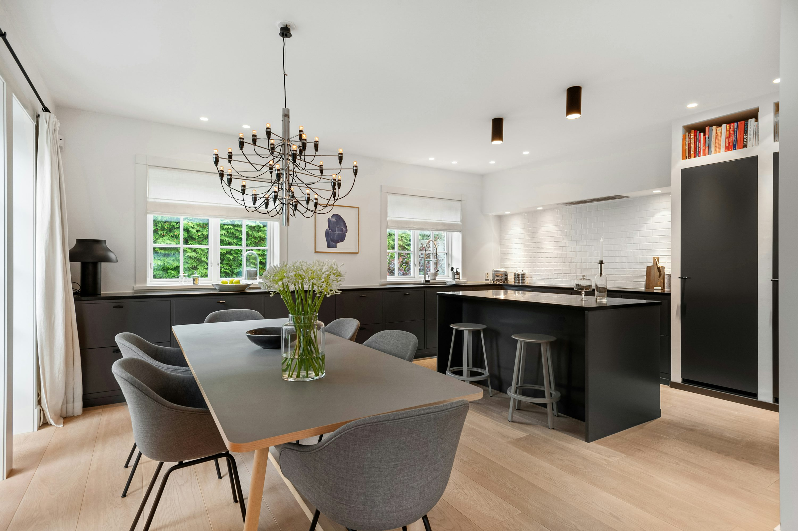

# Avery’s dining room — licensed stock-photo test fixture v1

This is a **fictional UI test project**, not a real client or a measured room. It uses one photograph, without invented alternative viewpoints. No image generation, model training, stock verification or external AI upload was performed.

## Brief
Fictional designer Mira Lane of Fieldline Studio is helping fictional client Avery Chen replace six dining chairs. Keep the pictured table, chandelier, cabinetry and island. Seek warm wood, comfortable backs and practical neutral seats, without requiring a matching furniture set. Avoid bulky arms and delicate upholstery.

The synthetic budget is **$2,400 target / $2,800 absolute delivered cap**, including six chairs, taxes, shipping and fees. The sample destination is Oakland ZIP94612; it is not the photo location. Assume an elevator building, weekday delivery and a six-week preference. Those logistics are invented and need confirmation in any real project.

## Geometry and truth
The manifest contains invented scenario dimensions: table84×40in, top30in, underside27in, room144×180in, doorway32in. None were measured or inferred from the photograph. The app’s measurement fields intentionally remain **null / Unknown** so the UI cannot mistake assumptions for confirmed geometry. Chair arms, apron spacing and walking clearances remain unknown. The fixture includes three real product-page leads, no decisions and no verified stock.

## Photo provenance
Photo: [A dining room table with chairs and a chandelier](https://unsplash.com/photos/a-dining-room-table-with-chairs-and-a-chandelier-4vRQHAi7DJs), by [Alex Tyson](https://unsplash.com/@alextyson195), published July28,2024; retrieved September17,2026. [Unsplash License](https://unsplash.com/license) and [terms](https://unsplash.com/terms) checked on retrieval. Exact download URL, file checksum and dimensions are in `manifest.json`.

This free photo’s copyright license permits the display/copy used here. Do not sell the photo standalone or build a competing image collection. Separate rights to depicted art/brands are not established; the photo includes wall art and books. No photographer, homeowner or product endorsement is implied. Unsplash restricts AI/ML dataset use. **External AI processing permission is unresolved and not enabled.** This is a local human-facing UI fixture, not an AI evaluation dataset.

## Run safely
From the repository root, using Python with Pillow:

```sh
python3 fixtures/dining-room-stock-v1/preview.py --check
python3 fixtures/dining-room-stock-v1/preview.py
```

Open http://127.0.0.1:8768/. The launcher uses the real app/server and local persistence helpers, a separate data directory at `/private/tmp/homely-stock-fixture-v1`, and no cloud account. Standard app routes remain enabled, including independent product URL import, brief editing, comparison, export and owner-only disclosure preview. Text research does not transmit the room image, but research/assistant/transcription need an API key; this launcher deliberately supplies none and makes no paid calls. The room starts with consent=false, so generation is blocked. Do not grant processing consent for this stock photo until rights are resolved. No cloud account is used.

`--seed-only` installs without starting a server. Repeated runs preserve existing fixture edits. An unmarked nonempty directory is refused. To create a fresh copy, pass a **new empty** `--data-dir`; never reset an existing user workspace. `--port` changes the loopback port. The template uses the current app project schema; the importer assigns a private local asset URL during seeding. Extra scenario metadata lives in the manifest instead of unsupported app fields.

## Evaluation
Use the cases in `manifest.json`: budget boundary, unknown delivered costs, unknown fit, selected-field disclosure, and non-destructive relaunch. Comparisons and rendering require future product evidence and separately cleared image rights; they are deliberately not simulated as completed here.



## Real product leads (checked September 17, 2026)

| Product | Observed unit price | Evidence limits |
|---|---:|---|
| [IKEA ODGER chair, anthracite](https://www.ikea.com/us/en/p/odger-chair-anthracite-50457313/) | $125 | Quantity, tax, shipping, fit and image rights unverified |
| [IKEA LISABO chair, ash](https://www.ikea.com/us/en/p/lisabo-chair-ash-00457235/) | $80 | Quantity, tax, shipping, fit and image rights unverified |
| [Mid-Century Upholstered Dining Chair — Wood Legs](https://www.westelm.com/products/mid-century-dining-chairs-h1361/) | Unknown | Quantity, tax, shipping, fit and image rights unverified; exact variant unselected |

IKEA prices are observed page prices, not delivered quotes. West Elm price was not recoverable from the inspected page. Merchant images are not licensed by merely linking their pages, so imageUrl stays null. These three leads support findings, comparison and sourcing tests; rendering still needs cleared product images and room rights.

## Permissive alternative research

[PxHere photo 670063](https://pxhere.com/en/photo/670063) is listed as CC0 and [the provider license](https://pxhere.com/en/license) confirms CC0 generally. The individual source page timed out during verification; it has not been downloaded or substituted. This is a follow-up candidate, not a cleared AI input. The saved Unsplash display fixture remains usable now.
